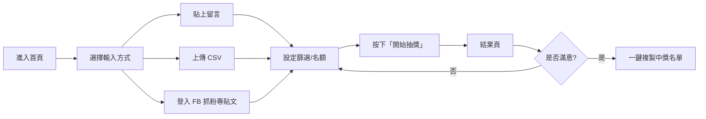

# facebook-comment-picker · PRD v3.0.2 等級規格書

> 自動生成：2026-09-06
> 對齊 SPEC v3.0 契約（SPEC §1–§19 全部套用）
> Repo: https://github.com/openclawsean024-create/facebook-comment-picker
> Live (Vercel): https://fb-giveaway-v2.vercel.app

---

## 1. 產品概述

### 1.1 問題陳述
粉絲專頁小編辦留言抽獎目前只能用「手動複製留言 + Excel RAND()」或付費工具 Gleam.io（US$5–100/月）。前者易出錯、後者介面複雜且收費。本專案提供 **3 種留言導入（貼上 / CSV / 書籤插件）+ 智慧篩選 + 隨機抽出 + 種子可重現 + 完全免費** 的單頁工具。

### 1.2 目標使用者
| Persona | 工作情境 | 主要任務 |
|---|---|---|
| Primary — FB 粉專小編 | 月辦 1-3 次抽獎 | 3 分鐘內完成「抽獎→公告中獎名單」 |
| Secondary — IG/微商賣家 | 行銷活動抽獎 | 同上 |
| Secondary — 行銷公司 | 客戶代辦 | 同上 + 結果可匯出 CSV 給客戶 |
| Secondary — 抽獎 SaaS 平台 | 想白標 | 觀摩程式碼 / fork |

### 1.3 核心價值主張
> 「完全免費的留言抽獎工具 — 3 種導入、智慧篩選、隨機抽出、種子可重現。」

### 1.4 Non-Goals（明確不做）
- ❌ AI Bot 自動抓 FB 留言（違反 FB 政策，會被封）
- ❌ 月費訂閱 / 付費牆
- ❌ 多人協作（單機單人）
- ❌ 雲端帳號 / 留言歷史同步（localStorage 為唯一 store）

---

## 2. 使用者場景與流程

### 2.1 使用者流程圖



### 2.2 主要場景

| 場景 | 輸入 | 輸出 | 成功條件 |
|---|---|---|---|
| 貼上純文字留言 | textarea | 去重後名單 | 解析出 ≥1 個有效名稱 |
| 上傳 CSV | file upload | 解析後名單 | 第一欄為姓名 / user_id |
| FB OAuth 抓粉專貼文 | 登入 + 選粉專 + 選貼文 | 留言 list | OAuth 完成 + 至少抓到 1 個留言 |
| 隨機抽獎（種子模式） | seed 數字 | 中獎名單 | 用相同 seed 跑兩次結果完全一致 |
| 排除關鍵字 | keyword list | 過濾後名單 | 含排除字的留言被剔除 |
| 結果匯出 | 點擊「複製」 | 剪貼簿有中獎名單 | Toast 顯示「已複製」 |

---

## 3. 功能需求

| FR | 名稱 | 優先級 | 狀態 |
|---|---|---|---|
| FR-001 | 貼上留言解析（3 種格式） | P0 | ✅ shipped |
| FR-002 | 同名去重 | P0 | ✅ shipped |
| FR-003 | 排除關鍵字 | P0 | ✅ shipped |
| FR-004 | 隨機抽出（種子可重現） | P0 | ✅ shipped |
| FR-005 | 中獎名單一鍵複製 | P0 | ✅ shipped |
| FR-006 | 結果 Toast 通知 | P0 | ✅ shipped |
| FR-007 | FB OAuth 登入 + 抓粉專貼文 | P1 | ✅ shipped (需 FB App 設定) |
| FR-008 | CSV 匯入 | P1 | ✅ shipped |
| FR-009 | 書籤插件 | P2 | ✅ shipped |
| FR-010 | PageSelectorModal（粉專/貼文 picker） | P1 | ✅ shipped |
| FR-011 | 結果下載 .txt / .csv | P2 | ⏳ planned |
| FR-012 | 多語系 (i18n dict) | P2 | ✅ partial (`src/lib/i18n.js`) |
| FR-013 | ESC 關閉 modal | P3 | ⏳ planned |

---

## 4. Non-Functional Requirements

| 維度 | 需求 |
|---|---|
| Performance | 首頁 LCP < 1.5s（含 FB SDK async） |
| Security | CSP / HSTS / X-Frame-Options / Referrer-Policy / Permissions-Policy 全部設定於 `vercel.json` |
| Privacy | 0 cookie、0 GA、0 Sentry；只 localStorage；FB token 走 serverless proxy |
| Accessibility | WCAG 2.1 AA：鍵盤 ESC 關 modal、focus ring、aria-label |
| Browser | Modern evergreen (Chrome/Edge/Safari/Firefox 兩個最新 major) |
| Bundle | Vite client bundle < 200KB gzipped |
| Rate Limit | serverless API 30-120 req/min per IP（`api/_lib/rate-limit.js`） |

---

## 5. 技術架構

```
┌─────────────────────────────────────────┐
│  Vercel                                 │
│  ├─ /  → dist/index.html (meta refresh) │
│  └─ /dashboard.html → standalone SPA   │
├─────────────────────────────────────────┤
│  Frontend (兩條並存)                      │
│  ├─ Vite build → dist/index.html       │
│  │  + src/ (React 18, 將來的主軸)        │
│  └─ dashboard.html (CDN Tailwind + 內嵌) │
│     目前 production 用的 fallback        │
├─────────────────────────────────────────┤
│  Serverless API (api/)                  │
│  ├─ facebook/auth.js    (OAuth 啟動)   │
│  ├─ facebook/callback.js (OAuth 收)    │
│  ├─ facebook/accounts.js  (抓粉專)     │
│  ├─ facebook/page-posts.js (抓貼文)     │
│  ├─ facebook/page-comments.js (抓留言)  │
│  ├─ facebook/parse-post.js (parse 網址) │
│  ├─ draw.js (抽獎 RNG)                  │
│  ├─ fetch-comments.js (備援爬蟲)        │
│  └─ _lib/rate-limit.js (IP 限流)        │
├─────────────────────────────────────────┤
│  Test                                    │
│  └─ Vitest (4 個檔, 40 tests)          │
│     ├─ src/lib/shuffle.test.js (4)     │
│     ├─ src/lib/lottery.test.js (26)    │
│     ├─ src/lib/rate-limit.test.js (6)  │
│     └─ tests/postbuild.test.js (4)     │
├─────────────────────────────────────────┤
│  CI/CD                                   │
│  └─ GitHub Actions (lint / test /       │
│     build / vercel deploy)               │
└─────────────────────────────────────────┘
```

### 5.1 Module Map
- `src/` — React 18 source (Vite entry，預備 future migration)
- `api/` — Vercel serverless functions
- `dashboard.html` — 單檔 standalone SPA（目前 production 用的 fallback）
- `index.html` — Vite entry (meta refresh → dashboard.html)
- `scripts/postbuild.mjs` — 構建後把 dashboard.html 複製到 dist/
- `tests/` — 構建產物驗證測試
- `src/lib/*.test.js` — 抽獎/RNG/rate-limit 單元測試
- `.github/workflows/ci.yml` — CI/CD

### 5.2 環境變數
- `VITE_FB_APP_ID` (前端，公開) — FB App ID
- `FACEBOOK_APP_ID` / `FACEBOOK_APP_SECRET` (server-side) — OAuth
- `FACEBOOK_REDIRECT_URI` (server-side) — callback URL
- `FACEBOOK_PAGE_ACCESS_TOKEN` (optional) — 預先生成的 long-lived page token
- `RAPID_API_KEY` (optional) — RapidAPI fallback
- 全部走 Vercel Dashboard env 設定；不入 git

### 5.3 降級策略
- FB OAuth 失敗 → 仍可手動貼上留言
- Vite build 失敗 → postbuild 仍把 dashboard.html 複製過去，production fallback 還在
- Rate limit 超過 → 回 429 + 友善錯誤訊息

---

## 6. Definition of Done

- [x] 功能 P0/P1 全部實作
- [x] 單元測試 40 個全綠（shuffle 4 + lottery 26 + rate-limit 6 + postbuild 4）
- [x] `npm run build` 綠，dist/ 內含 `index.html` + `dashboard.html`
- [x] `npm run lint` 0 error
- [x] GHA CI 4 jobs 全綠
- [x] README 反映現況
- [x] `PRD/SPEC.md` v3.0.2 對齊

---

## 7. 部署契約

| 環境 | 目標 | 觸發 |
|---|---|---|
| Production | Vercel (`fb-giveaway-v2`) | push to master |
| Preview | Per-PR Vercel preview URL | PR opened |

### 7.1 GHA Workflow
- `.github/workflows/ci.yml`
- jobs: lint / test / build / deploy
- deploy: `vercel`

### 7.2 環境變數
- `VERCEL_TOKEN` / `VERCEL_ORG_ID` / `VERCEL_PROJECT_ID` 由 repo admin 在 Vercel dashboard 設定後填到 GitHub repo secrets
- FB secrets 走 Vercel project env，**不**入 GitHub secrets

---

## 8. Out of Scope（不做的）

- ❌ 月費 / 訂閱
- ❌ AI Bot 抓 FB 留言（政策風險）
- ❌ 原生 App / PWA
- ❌ 多語系（i18n dict 已備但 v1 不啟用）
- ❌ Sentry / Analytics（隱私）

---

## 9. 變更日誌

見 [`PRD/CHANGELOG.md`](PRD/CHANGELOG.md)
